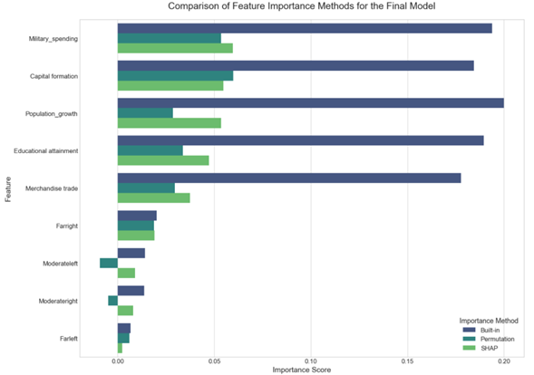
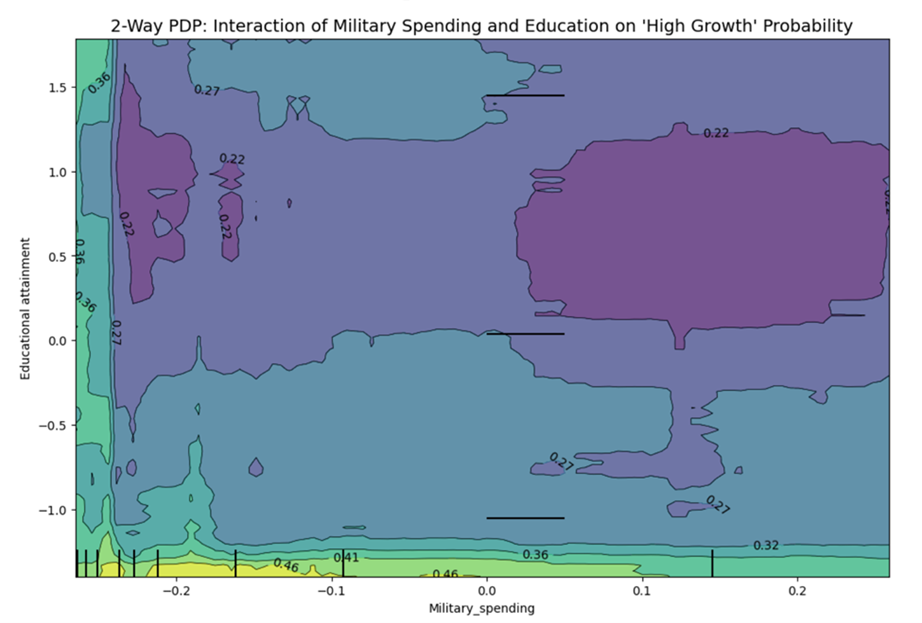

# Modeling the Conditional Relationship Between Military Expenditure and Economic Growth

### An Integrated Econometric and Machine Learning Analysis

**Author:** Illia Tykhyi | **Thesis for:** Bachelor of Economics, Uniwersytet Ekonomiczny w Krakowie | **Supervisor:** prof. dr hab. Robert Włodarczyk

---

### Abstract

The resurgence of geopolitical conflict has reignited the long-standing debate on the economic consequences of defense expenditure. This thesis moves beyond traditional linear models to re-evaluate the defense-growth nexus using an integrated data science approach. Employing a Random Forest model, complemented by a Multinomial Logistic Regression, this study analyzes a longitudinal dataset of 40 NATO and allied nations (1949-2022) to classify countries into Low, Medium, and High economic growth regimes. The findings reveal a clear hierarchy of influence, where core economic fundamentals—namely Capital Formation and Educational Attainment—are the primary drivers of economic growth. Military spending emerges as a significant but secondary predictor, with a complex, non-linear impact. Crucially, the analysis identifies a significant interaction effect: the negative economic impact of military spending is substantially mitigated by high levels of educational attainment, underscoring the role of human capital as a critical "absorptive capacity." The research concludes that the "guns vs. butter" trade-off is not fixed but is conditional, suggesting that sustainable security policy must be integrated with long-term investments in human and physical capital.

[**Read the Full Thesis (PDF)**](Waiting for the revision)

---

### Key Findings

*   **Hierarchy of Influence:** Core economic fundamentals (`Capital Formation`, `Educational Attainment`, `Population Growth`) are the most powerful predictors of economic growth regimes.
*   **The Role of Military Spending:** Defense spending is a significant but secondary driver, with a complex, non-linear relationship with growth.
*   **The "Guns vs. Butter" Trade-Off is Conditional:** The negative economic impact of military spending is significantly reduced in countries with a more educated populace, highlighting the role of human capital as a crucial "absorptive capacity."
*   **Limited Impact of Ideology:** A government's position on the political spectrum has a far weaker direct predictive impact compared to economic fundamentals.

### Visual Showcase: Key Results

**Final Model Feature Importance:** The analysis consistently shows that a handful of economic variables are the primary drivers of growth, with `Military Spending` and `Capital Formation` ranked at the top by the final model.



**The Interaction of Military Spending and Education:** The 2-Way Partial Dependence Plot reveals that the negative impact of military spending (moving left to right) is much less severe in countries with high educational attainment (top of the plot) than in those with low attainment (bottom of the plot).



---

### Methodology Overview

This project follows a comprehensive data science workflow:

1.  **Data Sourcing & Integration:** Data was aggregated from multiple sources, including the World Bank, SIPRI, and ILOSTAT, and merged into a single longitudinal dataset.
2.  **Data Preprocessing:** Handled significant missing data using advanced **Multiple Imputation by Chained Equations (MICE)**, engineered key features like `Population_growth`, and created the categorical target variable `GDP_growth_cat`.
3.  **Modeling & Selection:** Rigorously compared three models (Logistic Regression, Random Forest, Neural Network) using a 5-fold stratified cross-validation framework. The **Random Forest** was selected for its superior performance and stability.
4.  **Interpretation & Analysis:** Used a suite of modern techniques (**SHAP**, **Permutation Importance**, and **Partial Dependence Plots**) to interpret the final model and uncover the nuanced relationships between the variables.

---

### Repository Structure

```
├── Defense_Growth_Analysis.ipynb    # The main Jupyter Notebook with all code and analysis.
├── Tykhyi_Illia_Thesis_EKS1.pdf     # The full text of the bachelor's thesis.
├── requirements.txt               # A list of Python libraries needed to run the notebook.
├── Data/                            # Contains all raw CSV data files.
└── Visualizations/                  # Contains key plots and figures.
```

---

### How to Run This Project

1.  **Clone the repository:**
    ```bash
    git clone https://github.com/your-username/your-repository-name.git
    cd your-repository-name
    ```
2.  **Create a virtual environment (recommended):**
    ```bash
    python -m venv venv
    source venv/bin/activate  # On Windows, use `venv\Scripts\activate`
    ```
3.  **Install the required libraries:**
    ```bash
    pip install -r requirements.txt
    ```
4.  **Launch JupyterLab and open the notebook:**
    ```bash
    jupyter lab Defense_Growth_Analysis.ipynb
    ```

---

### Technologies Used

*   **Python 3**
*   **Key Libraries:** pandas, scikit-learn, TensorFlow/Keras, statsmodels, SHAP, missingno, seaborn, matplotlib.
